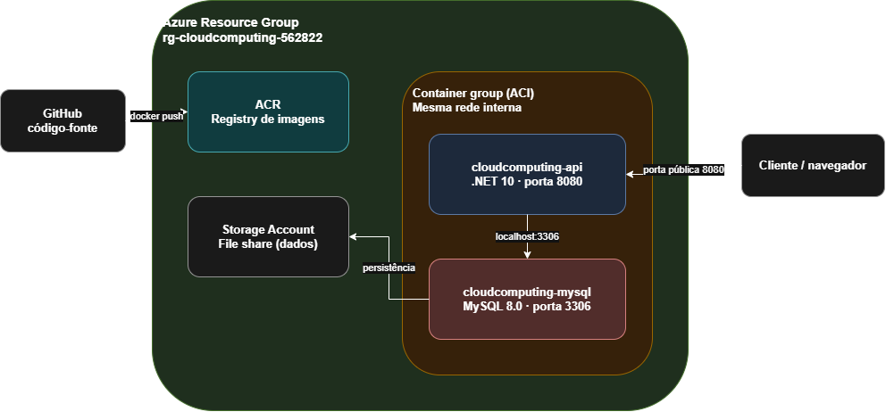

# 🐾 PetCare API — Cloud Computing (Sprint 3)

API REST para gestão de saúde animal, desenvolvida em .NET 10, containerizada com Docker e implantada na Azure via **Azure Container Registry (ACR) + Azure Container Instances (ACI)**, com banco de dados **MySQL 8.0** também containerizado.

> Este projeto reaproveita a base de código evoluída na disciplina de Advanced Business Development with .NET (arquitetura em camadas, observabilidade com Serilog/OpenTelemetry), adaptada aqui para banco de dados MySQL e infraestrutura ACR+ACI, conforme permitido pelo enunciado da Sprint 3 de DevOps Tools & Cloud Computing.

---

## Descrição da Solução

O **PetCare API** é um sistema de gestão de cuidados veterinários que permite:

- Cadastrar **Responsáveis** (tutores dos animais)
- Cadastrar **Animais**, vinculados a um Responsável
- Registrar **Eventos de Cuidado** (vacinas, consultas, exames, medicações, cirurgias etc.), vinculados a um Animal

As três entidades são relacionadas entre si (`Responsavel` → `Animal` → `CareEvent`) e formam o núcleo (CORE) da aplicação, com CRUD completo exposto via API REST documentada em Swagger.

## Benefícios para o Negócio

- **Centralização de dados**: histórico completo de saúde de cada animal acessível em qualquer lugar, sem depender de planilhas ou papel
- **Rastreabilidade**: cada evento de cuidado tem tipo, status (pendente/concluído/atrasado/cancelado) e prioridade, permitindo priorizar atendimentos
- **Escalabilidade**: arquitetura em containers (ACR + ACI) permite subir novas instâncias sob demanda, sem depender de uma VM fixa
- **Redução de custo operacional**: toda a infraestrutura é criada e destruída via script (`azure-deploy.sh` / `azure-destroy.sh`), evitando recursos ociosos cobrando na assinatura
- **Segurança**: o container da API roda com usuário sem privilégios administrativos (`USER 1654`), e nenhuma credencial fica exposta no código-fonte versionado
- **Observabilidade**: logs estruturados (Serilog) e métricas/tracing (OpenTelemetry) já embutidos, facilitando diagnóstico em produção

---

## Diagrama de Arquitetura



Um **Resource Group** na Azure agrupa três recursos: o **ACR** (onde a imagem Docker da API é armazenada), a **Storage Account** (que fornece um File Share para persistência dos dados do MySQL) e o **Container Group (ACI)**, que executa dois containers na mesma rede interna — a API .NET e o MySQL 8.0. O código-fonte no GitHub é buildado e enviado ao ACR via `docker push`. O cliente acessa a API publicamente pela porta 8080; internamente, a API se conecta ao MySQL via `localhost:3306`, já que os dois containers compartilham a mesma interface de rede dentro do grupo ACI. O MySQL persiste seus dados no File Share, para que nada se perca caso o container reinicie.

---

## Banco de Dados em Nuvem

- **Motor**: MySQL 8.0, containerizado, rodando junto com a API no mesmo grupo ACI
- **DDL completo** (tabelas, colunas, chaves primária/estrangeira e comentários): [`script_bd.sql`](script_bd.sql)
- **Tabelas CORE**: `T_CP_RESPONSAVEIS`, `T_CP_ANIMAIS`, `T_CP_CARE_EVENTS` — relacionadas entre si (Animal referencia Responsavel; CareEvent referencia Animal)
- **Massa inicial**: a aplicação insere automaticamente 2 registros em cada tabela no primeiro start (ver `Program.cs`), atendendo à exigência de conteúdo significativo mínimo

---

## Stack

- **.NET 10** / ASP.NET Core Web API
- **Entity Framework Core 9** + **Pomelo.EntityFrameworkCore.MySql** (provider MySQL)
- **MySQL 8.0** (Docker)
- **Serilog** (log estruturado, console + arquivo) e **OpenTelemetry** (tracing/métricas)
- **Docker** / **Docker Compose** (ambiente local)
- **Azure CLI**, **ACR**, **ACI**, **Storage Account** (infraestrutura em nuvem)

---

## Estrutura do Repositório

```
CloudComputing/
├── src/DotNet.Api/            # Código-fonte da API (.NET 10)
│   ├── Controllers/           # Endpoints REST
│   ├── Servicos/              # Regras de negócio
│   ├── Repositorios/          # Acesso a dados (EF Core)
│   ├── Models/                # Entidades de domínio
│   ├── Data/                  # AppDbContext + AppDbContextFactory (design-time)
│   ├── Migrations/            # Migrations do EF Core (já geradas para MySQL)
│   └── Infraestrutura/        # Health check e observabilidade
├── docs/
│   └── architecture-diagram.png
├── Dockerfile                 # Build multi-stage da API (roda como usuário 1654, não-root)
├── docker-compose.yml         # Ambiente local: API + MySQL
├── .env.example               # Modelo de variáveis de ambiente (sem credenciais reais)
├── script_bd.sql              # DDL das tabelas com comentários
├── aci-deploy.yaml.template   # Template do grupo de containers ACI
├── azure-deploy.sh            # Provisiona ACR + ACI via Azure CLI
└── azure-destroy.sh           # Remove todos os recursos criados
```

---

## Pré-requisitos

- [Docker Desktop](https://www.docker.com/products/docker-desktop/) (com backend WSL2, se Windows)
- [.NET 10 SDK](https://dotnet.microsoft.com/download) (apenas para rodar `dotnet ef` localmente, se necessário)
- [Azure CLI](https://learn.microsoft.com/cli/azure/install-azure-cli) autenticado (`az login`)
- `envsubst` (já vem com Git Bash/WSL/Linux/macOS)
- Uma conta Azure ativa (ex: Azure for Students)

---

## Como Executar — Validação Local

Esta etapa sobe a aplicação localmente via Docker Compose, para validar antes de ir para a nuvem.

### 1. Clonar o repositório

```bash
git clone https://github.com/FIAP-2026-CHALLENGE/CloudComputing.git
cd CloudComputing
```

### 2. Configurar as variáveis de ambiente

```bash
cp .env.example .env
```

Edite o `.env` e defina valores para `MYSQL_ROOT_PASSWORD`, `MYSQL_DATABASE`, `MYSQL_USER` e `MYSQL_PASSWORD`.

### 3. Subir os containers

```bash
docker compose up -d --build
```

### 4. Validar

- Swagger: [http://localhost:8081/swagger](http://localhost:8081/swagger)
- Health check: [http://localhost:8081/health](http://localhost:8081/health)

O primeiro start aplica as migrations e insere a massa de dados inicial automaticamente (ver logs com `docker logs cloudcomputing-api`).

---

## Como Executar — Deploy na Nuvem (ACR + ACI)

> ⚠️ Esta é a etapa que deve ser demonstrada no vídeo — a correção não aceita testes em `localhost`.

### 1. Autenticar na Azure

```bash
az login
```

### 2. Conferir as variáveis do script

Abra `azure-deploy.sh` e confirme `RM` e `LOCATION` no topo do arquivo.

### 3. Executar o deploy

```bash
chmod +x azure-deploy.sh azure-destroy.sh
./azure-deploy.sh
```

O script executa, nesta ordem:

```bash
az group create --name $RESOURCE_GROUP --location $LOCATION
az acr create --resource-group $RESOURCE_GROUP --name $ACR_NAME --sku Basic --admin-enabled true
az acr login --name $ACR_NAME
docker build -t cloudcomputing-api:v1 -f Dockerfile .
docker tag cloudcomputing-api:v1 $ACR_SERVER/cloudcomputing-api:v1
docker push $ACR_SERVER/cloudcomputing-api:v1
az storage account create --name $STORAGE_ACCOUNT --resource-group $RESOURCE_GROUP --sku Standard_LRS
az storage share create --name $FILE_SHARE --account-name $STORAGE_ACCOUNT --account-key $STORAGE_KEY
envsubst < aci-deploy.yaml.template > aci-deploy.yaml
az container create --resource-group $RESOURCE_GROUP --file aci-deploy.yaml
```

Ao final, o script imprime a URL pública do Swagger e do `/health`.

### 4. Validar na nuvem

- Swagger: `http://<dns-label>.<region>.azurecontainer.io:8080/swagger`
- Health check: `http://<dns-label>.<region>.azurecontainer.io:8080/health`

### 5. Validar o CRUD diretamente no banco (evidência exigida no vídeo)

Para cada operação de escrita (Create, Update, Delete) feita via Swagger, confirme diretamente no MySQL:

```bash
az container exec --resource-group $RESOURCE_GROUP --name $CONTAINER_GROUP --container-name cloudcomputing-mysql --exec-command "//bin/bash"
mysql -u root -p"$MYSQL_ROOT_PASSWORD" petcare -e "SELECT * FROM T_CP_RESPONSAVEIS;"
```

> Nota Windows/Git Bash: se `az container exec` falhar com erro de path (`exec: "C:/Program"...`), use `"//bin/bash"` (barra dupla) em vez de `"/bin/bash"` — é uma conversão automática de path do MSYS/Git Bash.

---

## Como Destruir os Recursos

```bash
./azure-destroy.sh
```

O script lista os recursos do Resource Group, pede confirmação explícita, e então remove tudo (ACR, ACI, Storage Account) via:

```bash
az group delete --name $RESOURCE_GROUP --yes --no-wait
```

---

## Notas de Segurança

- Nenhuma credencial está commitada no código-fonte. `appsettings.json` mantém a connection string vazia; o valor real é injetado via variável de ambiente (`ConnectionStrings__MySqlConnection`), lida do `.env` (local) ou gerada dinamicamente no `aci-deploy.yaml` (nuvem), nunca versionado.
- `.env` está no `.gitignore` — apenas o `.env.example` (com valores fictícios) é versionado.
- O container da API roda como usuário não-root (`USER 1654` no `Dockerfile`), atendendo à exigência de não rodar com privilégio administrativo.
- No `aci-deploy.yaml`, as senhas do MySQL usam `secureValue` (não `value`), impedindo que apareçam em texto plano em logs ou no `az container show`.
